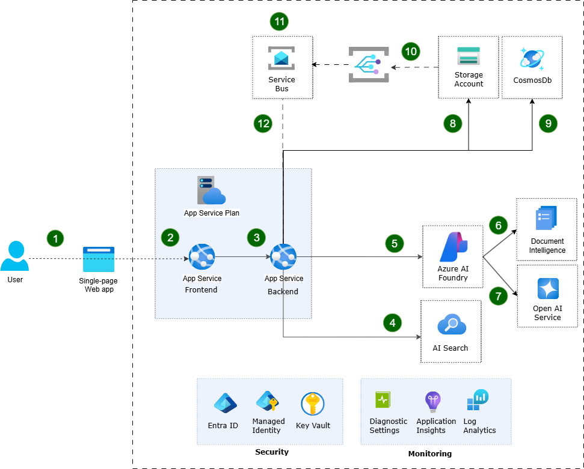

# AI-One Solution Design Document

## Purpose

This document outlines the architecture and design of the AI-One solution.

## Overview

AI-One is an enterprise AI platform designed to help organizations rapidly adopt AI safely, at scale, and with deep enterprise integration. It empowers enterprise, public sector, and commercial customers to create, validate, and deploy AI-driven use cases in minutes—not hours or days.

AI-One seamlessly connects with enterprise data and integration sources, solving the common challenges of AI adoption by providing:

- **Enterprise-grade AI orchestration** – unify and manage AI Assistants, Agents, and Chatbots across your organization.
- **Seamless scalability & security** – deploy AI solutions with role-based access control and enterprise authentication.
- **Frictionless AI use case validation** – experiment with new AI applications quickly, reducing time-to-value.
- **Centralized AI management** – streamline deployment, monitoring, and governance of AI solutions.
- **AI-powered search & data insights** – create AI Search Indexes, integrate unstructured data sources, and enhance decision-making with intelligent retrieval. 

By consolidating AI capabilities into a single, scalable platform, AI-One reduces complexity, accelerates innovation, and ensures AI solutions are robust, secure, and aligned with enterprise needs.

## Logical Architecture

The following diagram illustrates the logical architecture of the AI-One solution.


### Presentation Layer

- **Frontend**: Provides a web-based user interface to interact with the AI-One application.

### **Service Layer**

- **Application Data Services**: Implements the core business logic and data services to support application requirements - chat history, threads, assistant configurations etc.
- **Document Indexer**: Process the uploaded documents, extracting content, chunking text, and preparing data for vectorization.
- **Vector Search**: Semantic search service performing similarity matching and retrieval of relevant content from indexed documents
- **Chat Completion Service**: Orchestrates interactions with language models for generating responses based on user queries and document context.

### **Data Layer**

- **NoSQL Database**: Stores application data including chat history, threads, assistant configurations etc.
- **Vector Database**: Stores the vectorized content for semantic search and retrieval.
- **File Storage**: Stores the files uploaded by users.

### **AI Services**

- **OpenAI Service**: Language models for chat completions and generating text embeddings for semantic search.
- **Document Intelligence Service**: OCR and content extraction capabilities for processing various document formats (PDF, Word, images)
- **Speech Service**: Speech-to-text conversion enabling voice interactions

## Application Architecture



1. User – An end-user authenticated via Entra ID, accessing AI-One application.
2. App Service (Frontend) – Hosts the AI-One application UI.
3. App Service (Backend) – Backend services for all AI-One functionalities.
4. AI Search Service – Vector database for storing and retrieving knowledge base content.
5. Open AI Service – Provides the models for chat and embedding operations.
6. Document Intelligence – Processes and extracts information from documents (pdf, word etc.).
7. CosmosDB – Stores application data, including chat history.
8. Storage Account – Stores the files uploaded by users, such as documents or images.
9. Event Grid Topic Message – Publishes messages to the Event Grid when a new document is uploaded.
10. Event Grid Subscription – Subscribes to the Event Grid Topic to trigger indexing of the uploaded document.
11. Service Bus – Event-driven communication between services, allowing for asynchronous processing and integration.
12. Event Grid Notification – Triggers the document indexing process when a new document is uploaded.

## Azure Services Overview

| Azure Service                | Description                                                                                                                                                                                                                                                                                                                                                   |
|------------------------------|---------------------------------------------------------------------------------------------------------------------------------------------------------------------------------------------------------------------------------------------------------------------------------------------------------------------------------------------------------------|
| **Azure App Service**        | Fully managed hosting platform providing powerful web hosting for the application.                                                                                                                                                                                                                                                                            |
| **Azure OpenAI Service**     | REST API access to advanced language models for chat completions and embedding models for vector representations of text. Includes built-in content filtering and responsible AI guardrails.                                                                                                                            |
| **Azure AI Search**          | Enterprise-ready information retrieval system offering comprehensive search technologies for high-performance applications at any scale.                                                                                                                                                                               |
| **Azure Document Intelligence** | Cloud-based AI service using OCR, Text Analytics, and Custom Text to extract key-value pairs, text, tables, and structured data from documents including PDFs, Word documents, images, and forms.                                                                             |
| **Azure Speech Services**    | Advanced speech-to-text capabilities supporting real-time and batch transcription for converting audio streams into text.                                                                                                                                                                                              |
| **Azure Cosmos DB**          | Fully managed, serverless NoSQL database service with SLA-backed speed and availability, offering global distribution capabilities.                                                                                                                                                                                    |
| **Azure Blob Storage**       | Object storage solution optimized for massive amounts of unstructured data, providing secure, highly available, scalable, and redundant storage for documents, images, and static assets.                                                                                        |
| **Azure Event Grid**         | Fully managed event routing service enabling reactive programming with publish-subscribe semantics, serverless event ingestion, custom topics, and reliable delivery for event-driven architectures.                                                                              |
| **Azure Service Bus**        | Fully managed enterprise message broker providing reliable message queuing and durable publish/subscribe messaging, supporting advanced patterns like queues, topics, sessions, and dead letter handling.                                                                         |
| **Azure Key Vault**          | Cloud service for securely storing and accessing secrets, keys, and certificates.                                                                                                                                                                                                                                      |
| **Azure Application Insights** | Application performance management service offering comprehensive monitoring and telemetry collection for applications.                                                                                                                                                        |

## Data Flow

### Document Ingestion Pipeline

This can be broken down into two main processes: File Upload and Document Indexing.

#### File Upload Process

1. From the frontend, the user creates a new container. This action executes the following steps in the backend:
    - Create a new container in Blob Storage.
    - Create a new search index in Azure AI Search.
2. When a user uploads documents via the frontend, the File API receives the request and the UploadFileCommand stores the document in Blob Storage.
3. This triggers a "Blob Created Event" to Event Grid.


#### Document Ingestion Process

1. **Event Grid** routes the file upload event to the FileIndexer service.
2. The **FileIndexer** sends the document to **Document Intelligence Service** for processing to extract text and structure.
3. The extracted text is chunked into smaller segments for efficient retrieval. The size of the chunks is defined at the time of creating the container.
4. The text chunks are passed to the **OpenAI service** to generate vector embeddings for semantic search.
5. The vectorized content is stored in **Azure AI Search** for semantic retrieval.
6. The metadata about the uploaded document is added to the search record. This is necessary to provide citations when responding to user queries.


### 4. RAG (Retrieval-Augmented Generation) Pipeline

#### Invoking the RAG Pipeline

1. The user selects the assistant and starts a new conversation.
2. This step creates a new Chat Thread in the database using the ChatThread API.
3. When the user submits a query, the 'Chat Completion API' is invoked.
4. The `Chat Completion API` sends the request to the `ChatCommand` to process the query.


#### Generating Response

1. The master prompt template is fetched from the storage (local or remote).
2. The master prompt template is populated with the actual values for - system prompt, chat history and other parameters.
3. Before invoking the LLM, the search plugin is attached to the prompt. The plugin can retrieve relevant documents from the Azure AI Search index.
4. The master prompt nudges the LLM in using the plugin to retrieve relevant documents and use them in the response generation. If the model decides to use the plugin, it will return a response with the tool call to the plugin and the query to be used for the search.
5. The plugin retrieves the relevant documents from the Azure AI Search index and returns them to the LLM.
6. The LLM processes the query and the retrieved context, generating a final response.


## Database and Storage Design

### Azure Cosmos DB - Application Data Storage

It is the primary database for storing application transaction and configuration data.

### Chats

Stores chat threads, and messages.

**Message Record Structure**:

| Field | Type | Description |
|-------|------|-------------|
| **content** | string | The text content of the chat message |
| **type** | string | Type of the object (e.g., "Message") |
| **messageType** | string | Type of message indicating the sender (e.g., "User", "Assistant") |
| **threadId** | string (GUID) | Unique identifier of the chat thread this message belongs to |
| **options** | object | Additional options and metadata associated with the message |
| **options.IsLiked** | boolean | Whether the message has been liked by the user |
| **options.IsDisliked** | boolean | Whether the message has been disliked by the user |
| **createdDate** | string (ISO 8601) | Timestamp when the message was created |
| **lastModified** | string (ISO 8601) | Timestamp when the message was last modified |
| **id** | string (GUID) | Unique identifier for the message |

**Thread Record Structure**:

| Field | Type | Description |
|-------|------|-------------|
| **name** | string | The display name of the chat thread |
| **userId** | string | Identifier of the user who created the thread |
| **type** | string | Type of the object (e.g., "Thread") |
| **isBookmarked** | boolean | Whether the thread has been bookmarked by the user |
| **assistantId** | string (GUID) | Unique identifier of the assistant used in this thread |
| **promptOptions** | object | Configuration for AI model behavior used in this thread |
| **promptOptions.systemPrompt** | string | System instructions applied to this thread |
| **promptOptions.temperature** | number | Temperature setting used for AI responses (0.0-2.0) |
| **promptOptions.topP** | number | TopP setting used for AI responses (0.0-1.0) |
| **promptOptions.maxTokens** | integer | Maximum tokens setting for AI responses |
| **filterOptions** | object | Filter configuration applied to this thread |
| **filterOptions.documentLimit** | integer | Maximum number of documents to retrieve for context |
| **filterOptions.strictness** | number/null | Search strictness level for semantic matching |
| **filterOptions.folders** | array | List of folders included in the search scope |
| **filterOptions.tags** | array | List of tags used to filter search results |
| **createdDate** | string (ISO 8601) | Timestamp when the thread was created |
| **lastModified** | string (ISO 8601) | Timestamp when the thread was last modified |
| **id** | string (GUID) | Unique identifier for the thread |

### Assistants

Assistant configurations including system instructions, model configuration and filter options.

| Field | Type | Description |
|-------|------|-------------|
| **name** | string | The display name of the assistant |
| **description** | string | Optional description of the assistant's purpose and capabilities |
| **greeting** | string | Welcome message displayed when starting a conversation with the assistant |
| **type** | string | Type of assistant (e.g., "Chat") |
| **status** | string | Publication status of the assistant (e.g., "Published", "Draft") |
| **promptOptions** | object | Configuration for AI model behavior and responses |
| **promptOptions.systemPrompt** | string | System instructions that define the assistant's behavior and personality |
| **promptOptions.temperature** | number | Controls randomness in responses (0.0-2.0, typically 0.7) |
| **promptOptions.topP** | number | Controls diversity via nucleus sampling (0.0-1.0, typically 0.95) |
| **promptOptions.maxTokens** | integer | Maximum number of tokens in the response (typically 800-4000) |
| **filterOptions** | object | Configuration for knowledge base filtering and document access |
| **filterOptions.indexName** | string | Name of the Azure AI Search index to query for knowledge |
| **filterOptions.limitKnowledgeToIndex** | boolean | Whether to restrict responses to only indexed knowledge |
| **filterOptions.allowInThreadFileUploads** | boolean | Whether users can upload files during conversations |
| **filterOptions.documentLimit** | integer | Maximum number of documents to retrieve for context |
| **filterOptions.strictness** | number/null | Search strictness level for semantic matching |
| **filterOptions.folders** | array | List of specific folders to include in search scope |
| **filterOptions.tags** | array | List of document tags to filter search results |
| **accessControl** | object | Access control configuration for the assistant |
| **accessControl.contentManagers** | object | Permissions for users who can manage the assistant |
| **accessControl.contentManagers.allowAccessToAll** | boolean | Whether all users have management access |
| **accessControl.contentManagers.userIds** | array | List of specific user IDs with management permissions |
| **accessControl.contentManagers.groups** | array | List of Azure AD groups with management permissions |
| **accessControl.users** | object | Permissions for users who can use the assistant |
| **accessControl.users.allowAccessToAll** | boolean | Whether all users can access the assistant |
| **accessControl.users.userIds** | array | List of specific user IDs with access permissions |
| **accessControl.users.groups** | array | List of Azure AD groups with access permissions |
| **modelOptions** | object | Configuration for AI model selection and availability |
| **modelOptions.allowModelSelection** | boolean | Whether users can choose different models during conversation |
| **modelOptions.models** | array | List of available AI models for the assistant |
| **modelOptions.models[].modelId** | string | Identifier of the AI model (e.g., "GPT-4o", "o3-mini") |
| **modelOptions.models[].isSelected** | boolean | Whether this model is currently selected |
| **modelOptions.defaultModelId** | string | Default model to use when starting conversations |
| **createdDate** | string (ISO 8601) | Timestamp when the assistant was created |
| **lastModified** | string (ISO 8601) | Timestamp when the assistant was last modified |
| **id** | string (GUID) | Unique identifier for the assistant |

### Files

Stores metadata about uploaded documents

| Field | Type | Description |
|-------|------|-------------|
| **name** | string | The original filename of the uploaded document |
| **status** | string | Processing status of the document (e.g., "Indexed", "Processing", "Failed") |
| **url** | string | Full Azure Blob Storage URL where the document is stored |
| **contentType** | string | MIME type of the document (e.g., "application/pdf", "application/vnd.openxmlformats-officedocument.wordprocessingml.document") |
| **size** | integer | File size in bytes |
| **indexName** | string | Name of the Azure AI Search index where the document is indexed |
| **folderName** | string | Optional folder path for document organization |
| **tags** | array/null | Optional tags for document categorization and filtering |
| **createdDate** | string (ISO 8601) | Timestamp when the document was uploaded |
| **lastModified** | string (ISO 8601) | Timestamp when the document metadata was last updated |
| **id** | string (GUID) | Unique identifier for the document |

### Indexes

File Container configuration for search indexing

### Container Configuration Schema

| Field | Type | Description |
|-------|------|-------------|
| **name** | string | The display name of the container |
| **description** | string | Optional description providing details about the container's purpose |
| **chunkSize** | integer | Size of text chunks in characters for document processing (typically 1000-2000) |
| **chunkOverlap** | integer | Number of overlapping characters between chunks to maintain context |
| **accessControl** | object | Access control configuration for the container |
| **accessControl.contentManagers** | object | Permissions for users who can manage content in the container |
| **accessControl.contentManagers.allowAccessToAll** | boolean | Whether all users have content management access |
| **accessControl.contentManagers.userIds** | array | List of specific user IDs with content management permissions |
| **accessControl.contentManagers.groups** | array | List of Azure AD groups with content management permissions |
| **accessControl.users** | object | Permissions for users who can access content in the container |
| **accessControl.users.allowAccessToAll** | boolean | Whether all users have read access to the container |
| **accessControl.users.userIds** | array | List of specific user IDs with read access |
| **accessControl.users.groups** | array | List of Azure AD groups with read access |
| **taggingSettings** | array | Configuration for document tagging and categorization |
| **createdDate** | string (ISO 8601) | Timestamp when the container was created |
| **lastModified** | string (ISO 8601) | Timestamp when the container was last modified |
| **id** | string (GUID) | Unique identifier for the container |

### Audits

Stores audit logs for the conversation threads and messages.

**Message Audit Record Structure**:

| Field | Type | Description |
|-------|------|-------------|
| **type** | string | Type of audit event being logged (e.g., "Message") |
| **payload** | object | The actual message data being audited |
| **payload.content** | string | The text content of the message |
| **payload.type** | string | Type of the payload object (e.g., "Message") |
| **payload.messageType** | string | Type of message indicating the sender (e.g., "User", "Assistant") |
| **payload.threadId** | string (GUID) | Unique identifier of the thread this message belongs to |
| **payload.options** | object | Additional options or metadata associated with the message |
| **payload.createdDate** | string (ISO 8601) | Timestamp when the original message was created |
| **payload.lastModified** | string (ISO 8601) | Timestamp when the original message was last modified |
| **payload.id** | string (GUID) | Unique identifier of the original message being audited |
| **createdDate** | string (ISO 8601) | Timestamp when the audit record was created |
| **lastModified** | string (ISO 8601) | Timestamp when the audit record was last modified |
| **id** | string (GUID) | Unique identifier for the audit record |

**Thread Audit Record Structure**:

| Field | Type | Description |
|-------|------|-------------|
| **type** | string | Type of audit event being logged (e.g., "Thread") |
| **payload** | object | The actual data being audited or tracked |
| **payload.name** | string | Name or title of the audited item (e.g., thread name) |
| **payload.userId** | string | Email address or identifier of the user who performed the action |
| **payload.type** | string | Type of the payload object (e.g., "Thread") |
| **payload.isBookmarked** | boolean | Whether the thread is bookmarked by the user |
| **payload.assistantId** | string (GUID) | Unique identifier of the assistant used in the thread |
| **payload.promptOptions** | object | Configuration for AI model behavior at the time of audit |
| **payload.promptOptions.systemPrompt** | string | System instructions used for the thread |
| **payload.promptOptions.temperature** | number | Temperature setting used (0.0-2.0) |
| **payload.promptOptions.topP** | number | TopP setting used (0.0-1.0) |
| **payload.promptOptions.maxTokens** | integer | Maximum tokens setting used |
| **payload.filterOptions** | object | Filter configuration used for the thread |
| **payload.filterOptions.documentLimit** | integer | Document limit setting applied |
| **payload.filterOptions.strictness** | number/null | Search strictness level applied |
| **payload.filterOptions.folders** | array | List of folders included in the filter |
| **payload.filterOptions.tags** | array | List of tags included in the filter |
| **payload.createdDate** | string (ISO 8601) | Timestamp when the original item was created |
| **payload.lastModified** | string (ISO 8601) | Timestamp when the original item was last modified |
| **payload.id** | string (GUID) | Unique identifier of the original item being audited |
| **createdDate** | string (ISO 8601) | Timestamp when the audit record was created |
| **lastModified** | string (ISO 8601) | Timestamp when the audit record was last modified |
| **id** | string (GUID) | Unique identifier for the audit record |

### Azure AI Search - Vector Data Storage

AI Search is used for storing vectorized content and metadata for semantic search and retrieval.
A new index is created for each container, to allow for independent search configurations and access control for different document sets.

**Index Structure**:

| Field | Type | Dimensions | Description |
|-------|------|------------|-------------|
| **Id** | String | - | Unique identifier for the document chunk |
| **FileId** | String | - | Reference to the original file in storage |
| **Chunk** | String | - | Text segment content for searchable text |
| **Name** | String | - | Document or chunk name for identification |
| **Tags** | StringCollection | - | Categorization tags for filtering and organization |
| **ChunkVector** | SingleCollection | 1536 | High-dimensional embeddings generated from chunk content |
| **NameVector** | SingleCollection | 1536 | Vector embeddings generated from document names |
| **Url** | String | - | Reference URL to the source document or chunk location |

### Azure Blob Storage - Document File Storage

The blob storage is used for storing raw documents uploaded by users.

```

├── documents/
│   ├── index-content/
│   │   ├── {file-container-name}/  
│   │       ├── file-1
│   │       ├── file-2
│   │   

```
